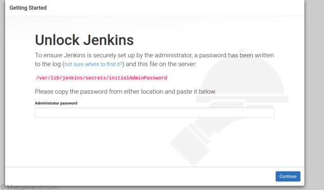

# Simple Web app for CI/CD pipeline

### Introduction to Flask
---

Flask is a lightweight, micro web development framework for Python. Compared to the higher-level frameworks, it’s much more flexible and, best of all, it doesn’t get in your way as you’re building out your web site. You can add complexity as your application grows. It’s great for beginners who want to better understand the shortcuts that larger, high-level web frameworks employ.

This repository also utilises a navbar from Bootstrap which I inherit with extends to make it available throughout the website

### Travis CI [](https://travis-ci.org/LaminaSA/CI-CD_WebApp)
---


Travis CI is a continuous integration service used to build and test projects hosted on version control repositories (github in this case). I chose to use Travis CI to run my integration tests on this project because of its ease of use.

All I needed to do to trigger a CI build was:

1) Create a .travis.yml file in the rood directory of my project
2) Provision the file with the instructions need to run my tests: 
    ```yaml
    os:
      - linux
    
    dist: xenial
    
    language: python
    
    python:
      - "3.8"
    html:
      - "5"
    
    install:
      - pip install flask
    
    
    script:
     - python -m pytest -v
    
    ``` 
3) ``git add .``, ``git commit``, ``git push``
4) Once the project with the yml file is pushed to git, a build is triggered, the relevant branch is pulled, the app is built and tests are run. Travis also emails me the results of my build.


### Jenkins
---
Jenkins offers a simple way to set up a continuous integration or continuous delivery (CI/CD) environment for almost any combination of languages and source code repositories using pipelines, as well as automating other routine development tasks.

**Documentation** 
1) Create ec2 instances
    > Make sure to create an instance for the 'Master', 'Worker' and 'Agent node'
2) ssh into instance

3) When inside instance download all the prereqs 

    ```shell script
    wget -q -O - https://pkg.jenkins.io/debian/jenkins-ci.org.key | sudo apt-key add -
    echo deb https://pkg.jenkins.io/debian-stable binary/ | sudo tee /etc/apt/sources.list.d/jenkins.list
    
    sudo apt-get update -y
    
    # sudo apt-get remove jenkins if bugs occurs and install openjdk
    
    #Install java
    sudo apt install openjdk-8-jre
    
    sudo apt-get update
    
    
    # Install Jenkins
    sudo apt-get install jenkins
    sudo systemctl start jenkins
    sudo systemctl status jenkins
    ```
    - I put them into an sh file, `chmod+x` then ran the file with `./<filename>`

4) Next paste the IP of your master EC2 instance into your browser with xxx..xx.xxx:8080

     
 
5) Then go into `sudo su`

    - `cat /var/lib/jenkins/secrets/initialAdminPassword`
    - this reveals the password the website is asking for

6) Install selected plugins

7) Create admin user

### Agent node

1. create agent
2. /opt/jenkins
3. Manage Jenkins → configure system → in Jenkins URL, enter new BOSS ip
4. code in sudo su of agent instance `java -jar agent.jar -jnlpUrl http://54.194.183.13:8080/computer/AgentNode/slave-agent.jnlp -secret fd5116e1d38848f3ee704de6044c5b01ac3c17236dab0b420ed5eae457e8a548 -workDir "/opt/jenkins"`
    - make sure IP is the same as current boss ip
    
### Plugins (for CD job)

Docker Pipeline

SSH Agent

Generic Web-hooks
